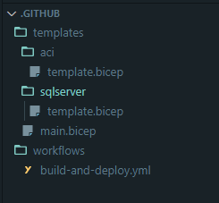
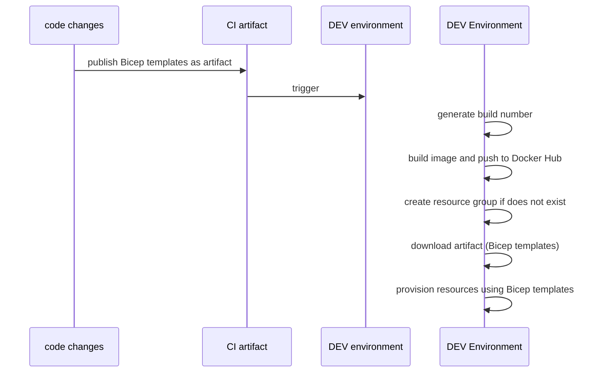

# SQL Database migrations with Azure Container Instances and DbUp

## Table of Contents

- [Introduction](#introduction)
- [Azure Container Instances](#azure-container-instances-aci)
- [DbUp](#dbup)
- [Console app to migrate the database](#application) 
- [CI/CD with GitHub Actions](#cicd-with-github-actions-and-azure-bicep)
- [Deployments](#deployments)


## Introduction

When designing applications, having a data store is very common. Regardless of microservices or any other methodology you use designing the data store will be different compared to how you design your application.

Although the data store migration activities will be associated with your application changes, separating that from your application code is important, so that they can be treated separately. 

In here we will be migrate a `SQL database` using `Azure Container Instances`.

[<<back](#table-of-contents)


## Azure Container Instances (ACI)

The database migration activities doesn't need to be continuously monitoring or running in the background. These activities are usually carried out at the start of the application.

Azure container instances is a perfect fit for this because,
* If you are designing systems using containers, you don't want to deviate to a different strategy just to deploy your database migrations.
* There is no need for container orchestrations.
* A short lived activity, and you'll be paying only for the time the container was running.
* You can "choose" how much compute you will need. In this case we will be using 1 CPU and 1GB of memory.

>*Running a container in an ACI as a sidecar to your application will be the perfect scenario. In an another article will be covering that.* 

For more in depth information about ACI please refer the [documentation](https://docs.microsoft.com/en-us/azure/container-instances/container-instances-overview)

[<<back](#table-of-contents)

## DbUp

DbUp is a very nice little library where you can use .NET to write your database migration activities. It supports a wide variety of relation databases.

What I like most about `DbUp` is you can write the database migration queries in the way you want. You have full control over the queries which you write, and `DbUp` will use your scripts to perform the migration. If using entity framework's migration activities, you will need to write code to do that, but you will be unaware (or somewhat abstracted) about the real SQL queries generated to perform the upgrades.
The next feature I like about `DbUp` is that how it keeps track of the queries/migration activities performed, and execute only what's necessary to upgrade the database.

I use a convention to name my queries like `yyyyMMddHHmm-[query name].sql`. In this way the queries are numbered and `DbUp` simply orders them and execute them in order. Simples!

[<<back](#table-of-contents)

## Application

Let's create a .NET 6 Console application, and add the below code

```csharp
using DbUp;

Console.WriteLine("Starting database migrations");

var serverName = Environment.GetEnvironmentVariable("SERVER_NAME");
var userName = Environment.GetEnvironmentVariable("USERNAME");
var password = Environment.GetEnvironmentVariable("PASSWORD");
var databaseName = Environment.GetEnvironmentVariable("DATABASE_NAME");

var connectionString = $"Server={serverName},1433;Database={databaseName};User Id={userName};Password={password};";

EnsureDatabase.For.SqlDatabase(connectionString);

var upgradeEngineBuilder = DeployChanges.To
    .SqlDatabase(connectionString)
    .WithScriptsEmbeddedInAssembly(typeof(Program).Assembly)
    .WithTransactionPerScript()
    .LogToConsole();

var upgradeEngine = upgradeEngineBuilder.Build();
if (upgradeEngine.IsUpgradeRequired())
{
    Console.WriteLine("Database migrations must be performed");

    var operation = upgradeEngine.PerformUpgrade();
    if (operation.Successful)
    {
        Console.WriteLine("Database migration successful");
        return 0;
    }

    Console.WriteLine("Database migration failed");
    return -1;
}

Console.WriteLine("Database migrations are not required");
return 0;
```

* The "database server name", "database name", "user name" and "password" are passed as environment variables. Not just the connection string. I have found passing these parameters separately rather than the full connection string is more secure, because then you don't want to output the connection string from the deployed resource or do some other DevOpsy gymnastics just to get the connection string :relieved:
* The database migration scripts are set as embedded resources, so that they will be part of the DLL itself. in this way no need to load the scripts from an external storage. Note that `DbUp` have few options how you can load your scripts to be executed.
* All the scripts are executed as a transaction (`WithTransactionPerScript`).
* return values are important, negative number represents a failure and zero represents a successful migration.

The `Docker` file to create the image for the database migration (Thanks `RIDER`!)

```dockerfile
FROM mcr.microsoft.com/dotnet/runtime:6.0 AS base
WORKDIR /app

FROM mcr.microsoft.com/dotnet/sdk:6.0 AS build
WORKDIR /src
COPY ["BankingDataStore.Console/BankingDataStore.Console.csproj", "BankingDataStore.Console/"]
RUN dotnet restore "BankingDataStore.Console/BankingDataStore.Console.csproj"
COPY . .
WORKDIR "/src/BankingDataStore.Console"
RUN dotnet build "BankingDataStore.Console.csproj" -c Release -o /app/build

FROM build AS publish
RUN dotnet publish "BankingDataStore.Console.csproj" -c Release -o /app/publish

FROM base AS final
WORKDIR /app
COPY --from=publish /app/publish .
ENTRYPOINT ["dotnet", "BankingDataStore.Console.dll"]

```

To develop and test in your local environment, I created a `Docker compose` file so that it can be attached with your IDE. I am using `JetBrains RIDER`, and it seamlessly hooks up with the file and will give you the local debugging experience for your database migration activity.

```dockerfile
version: '3.4'
services:
  dbsetup:
    build:
      dockerfile: BankingDataStore.Console/Dockerfile
    restart: on-failure      
    depends_on:
      - database
    environment:
      SERVER_NAME: "database"
      USERNAME: "sa"
      PASSWORD: "Pa55w0rd123!"
      DATABASE_NAME: "customeraccountsdb"
    
  database:
    image: mcr.microsoft.com/mssql/server:2019-latest
    restart: always
    environment:
      ACCEPT_EULA: "Y"
      SA_PASSWORD: "Pa55w0rd123!"
    ports:
      - "1433:1433"
    volumes:
      - ./bankdata/data:/var/opt/mssql/data
      - ./bankdata/logs:/var/opt/mssql/log
      - ./bankdata/secrets:/var/opt/mssql/secrets

```

[<<back](#table-of-contents)

## CI/CD with GitHub Actions and Azure Bicep

Let's create a CI/CD pipeline using GitHub Actions to deploy the database migrations in Azure.

The pipeline has been organized as shown below,



The Azure Bicep templates are residing in a folder called `templates` and each Bicep template has it's own folder which represents the resource it will be deploying.
The `main.bicep` template as per the name is the "main" template (:grin:) where it orchestrates the deployments.

Please refer the `.github` directory for these templates.




[<<back](#table-of-contents)

### Deployments

[<<back](#table-of-contents)

